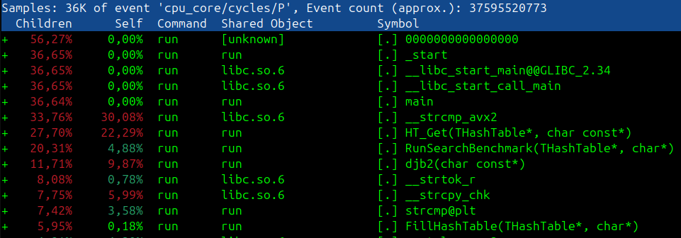
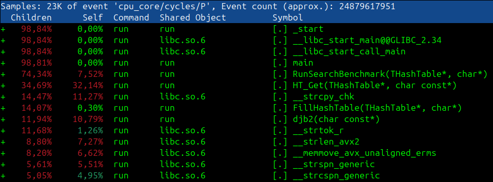

# Hash Table

The goal of this project is to develop and optimize a hash table.

# Theoretical information
## Introduction
A hash table is a data structure for storing key pairs and their values. In fact, it is an array where the location of the element depends on the value of the element itself. The relationship between the value of an element and its position in the hash table is set by the hash function. An important property of the hash table is that the search, insertion and deletion of elements from the table are performed in a fixed time.
## Hash function
A hash function is a function that takes an element as an argument (which needs to be inserted into a hash table), and as a result outputs the position of the specified element in the hash table.

For an ideal hash function, the following conditions are met:

- The hash function is deterministic, meaning the same message leads to the same hash value.
- The hash value is calculated quickly for any message.
- It is impossible to find a message that gives a given hash value.
- It is impossible to find two different messages with the same hash value.
- A small change in the message changes the hash so much that the new and old values seem uncorrelated.

A situation where the same hash value is obtained for different keys is called a collision. Two common methods of dealing with collisions are linear probing and the chain method. This project uses the chain method.

The project uses DJB2 as a hash function. DJB2 is a simple, fast, and efficient non-cryptographic hash function created by Daniel J. Bernstein (hence the name DJB). It is widely used in hash tables, compilers, and other applications where speed and a decent distribution of hash values are required, but cryptographic security is not necessary.

<details>
<summary>Show DJB2 code</summary>

```cpp
unsigned djb2(const char* key) {
    unsigned hash = 0;
    while (*key) {
        hash = (hash << 5) + hash + *key++;
    }
    return hash;
}
```
</details> 

## Settings
|                         |                                    |
|-------------------------|------------------------------------|
| CPU                     | 12th Gen Intel Core i5-12450H × 12 |
| Average CPU frequency   | 2.0 GHz                            |
| The operating system    | Ubuntu 24.04.2 LTS                 |
| Kernel Version          | Linux 6.11.0-21-generic            |
| gcc compiler version    | 13.3.0                             |
| Load factor             | 18                                 |
| Utilities               | perf, hyperfine                               |

# Program optimization

## Initial performance
##### Time interval of program execution: 9.115 ± 0.275 seconds.

##### The hottest functions:
- ```strcmp``` (30.08% of the time)
- ```HT_Get``` (22.29% of the time)
- ```djb2``` (9.87% of the time)



## Optimization of ```strcmp```
Each word in the text is no longer than 32 characters. This makes SIMD optimization possible.
```c
static int FastStrcmp(const char* s1, const char* s2) {
    const __m256i vec1 = _mm256_load_si256((const __m256i*)s1);
    const __m256i vec2 = _mm256_load_si256((const __m256i*)s2);
    const __m256i res = _mm256_xor_si256(vec1, vec2);
    return !_mm256_testz_si256(res, res);
}
```
Let's analyze the results after optimization:
##### Time interval of program execution: 6.124 ± 0.109 seconds (48.84% increase in work speed).

##### The hottest functions:
- ```HT_Get``` (32.14% of the time)
- ```strcpy``` (11.27% of the time)
- ```djb2``` (10.79% of the time)

