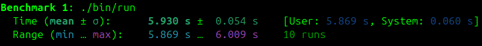

# Hash Table

The goal of this project is to develop and optimize a hash table.

# Theoretical information
## Introduction
A hash table is a data structure for storing key pairs and their values. In fact, it is an array where the location of the element depends on the value of the element itself. The relationship between the value of an element and its position in the hash table is set by the hash function. An important property of the hash table is that the search, insertion and deletion of elements from the table are performed in a fixed time.
## Hash function
A hash function is a function that converts an array of input data of arbitrary size into an output bit string of a certain size in accordance with a certain algorithm. The hash function is used, for example, in hash tables to calculate the key position in the table.

For an ideal hash function, the following conditions are met:

- The hash function is deterministic, meaning the same message leads to the same hash value.
- The hash value is calculated quickly for any message.
- It is impossible to find a message that gives a given hash value.
- It is impossible to find two different messages with the same hash value.
- A small change in the message changes the hash so much that the new and old values seem uncorrelated.

A situation where the same hash value is obtained for different keys is called a collision. Two common methods of dealing with collisions are linear probing and the chain method. This project uses the chain method.

CRC32 (Cyclic Redundancy Check) is a fast non-cryptographic hash function. It ensures an even distribution of hash values and is quite efficient. In addition, the processors support a special crc32 instruction, which we will use in our project.

```c
uint32_t crc32(const char* key, size_t length) {
    uint32_t hash = 0x0BA0BAB0;
    
    for (size_t i = 0; i < length; i++) {
        asm volatile (
            "crc32b %1, %0"
            : "+r" (hash)
            : "rm" (key[i])
        );
    }

    return hash;   
}
```

## Settings
|                         |                                    |
|-------------------------|------------------------------------|
| The operating system    | Ubuntu 24.04.2 LTS                 |
| Kernel Version          | Linux 6.11.0-21-generic            |
| gcc compiler version    | 13.3.0                             |
| libc version            | 2.39                               |
| Utilities               | perf, hyperfine                    |
| Load factor             | 18                                 |

# Program optimization

## Initial performance
##### Time interval of program execution: 9.115 ± 0.275 seconds.

##### The hottest functions:
- ```strcmp``` (24.49% of the time)
- ```HT_Get``` (20.86% of the time)
- ```crc32``` (6.38% of the time)

## Optimization of ```strcmp```
Each word in the text is no longer than 32 characters. This makes SIMD optimization possible.
```c
static int FastStrcmp(const char* s1, const char* s2) {
    const __m256i vec1 = _mm256_load_si256((const __m256i*)s1);
    const __m256i vec2 = _mm256_load_si256((const __m256i*)s2);
    const __m256i res = _mm256_xor_si256(vec1, vec2);
    return !_mm256_testz_si256(res, res);
}
```
Let's analyze the results after optimization:
##### Time interval of program execution: 6.241 ± 0.069 seconds (46.05% increase in work speed).

##### The hottest functions:
- ```HT_Get``` (25.40% of the time)
- ```crc32``` (7.10% of the time)


## Optimization of ```crc32```
In the hash function, only one element is processed at each iteration of the loop. Let's optimize loop unrolling, so we can process multiple elements in one iteration, in our case two elements.
```c
uint32_t crc32(const char* key, size_t length) {
    uint32_t hash = 0x0BA0BAB0;
    size_t i = 0;

    for (; i + 2 <= length; i += 2) {
        uint16_t word = *((const uint16_t*)(key + i)); 
        
        asm volatile (
            "crc32w %1, %0"
            : "+r" (hash)
            : "rm" (word)
        );
    }

    if (i < length) {
        asm volatile (
            "crc32b %1, %0"
            : "+r" (hash)
            : "rm" (key[i])
        );
    }

    return hash;
}
```
##### Time interval of program execution: 5.930 ± 0.054 seconds (5.24% increase in work speed).


# Optimization results
With the help of machine-dependent optimizations implemented using SIMD instructions and the inline assembler, we managed to reduce the program's running time from 9.115 seconds to 5.930 seconds (program acceleration by 53.71%).